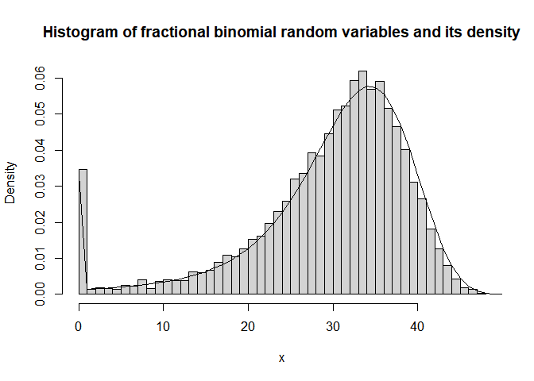

<!-- README.md is generated from README.Rmd. Please edit that file -->

# frbinom

<!-- badges: start -->
<!-- badges: end -->

The goal of frbinom is to generate random variables of fractional
binomial distribution and compute its density, cumulative distribution,
and quantiles.

## Installation

You can install the development version of frbinom from
[GitHub](https://github.com/) with:

``` r
# install.packages("devtools")
devtools::install_github("leejeo25/frbinom")
```

## Example

10 random variables of a fractional binomial distribution.

``` r
library(frbinom)
rfrbinom(n=10, size=50, prob=.6, h=.8, c=.2)
#>  [1] 25 38 38 37 36 10 40 19 38 41
```

The probability density of the fractional binomial distribution.

``` r
dfrbinom(x=seq(0,50,1), size=50, prob=.6, h=.8, c=.2)
#>  [1] 6.799943e-02 1.752837e-03 1.872218e-03 2.003956e-03 2.149729e-03
#>  [6] 2.311499e-03 2.491554e-03 2.692581e-03 2.917740e-03 3.170756e-03
#> [11] 3.456038e-03 3.778812e-03 4.145285e-03 4.562846e-03 5.040299e-03
#> [16] 5.588136e-03 6.218853e-03 6.947311e-03 7.791114e-03 8.771009e-03
#> [21] 9.911241e-03 1.123980e-02 1.278848e-02 1.459247e-02 1.668939e-02
#> [26] 1.911728e-02 2.191119e-02 2.509783e-02 2.868779e-02 3.266505e-02
#> [31] 3.697371e-02 4.150292e-02 4.607212e-02 5.042028e-02 5.420466e-02
#> [36] 5.701609e-02 5.841701e-02 5.800573e-02 5.550286e-02 5.084538e-02
#> [41] 4.426181e-02 3.629518e-02 2.774511e-02 1.952225e-02 1.244436e-02
#> [46] 7.039594e-03 3.436154e-03 1.389766e-03 4.368470e-04 9.492490e-05
#> [51] 1.070436e-05
```

The histogram of fractional binomial random variables overlaid with its
density.

``` r
simu.<-rfrbinom(10000, 50, .6, .7, .2)
den.<-dfrbinom(seq(0,50,1), 50, .6, .7, .2)
hist(simu., breaks=51, probability = TRUE)
lines(seq(0,50,1), den., type="l")
```


